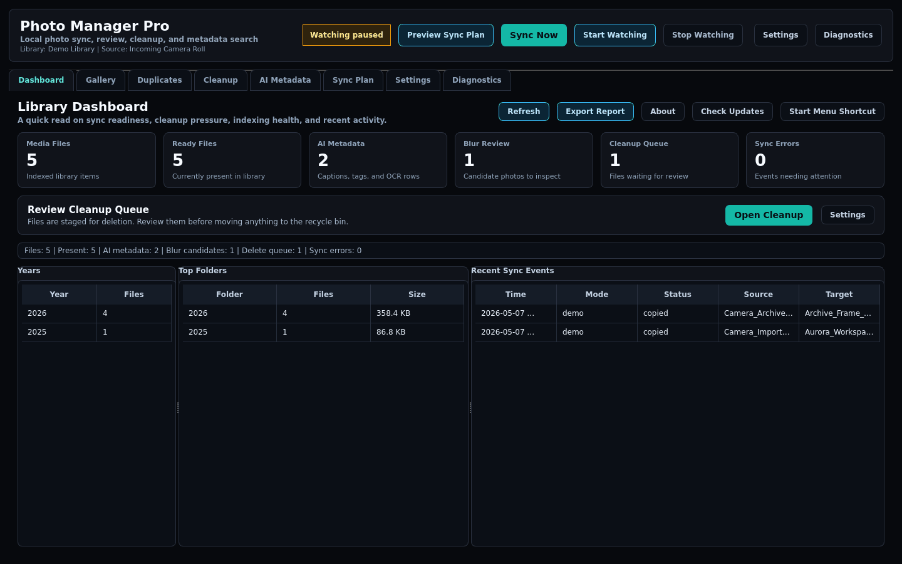
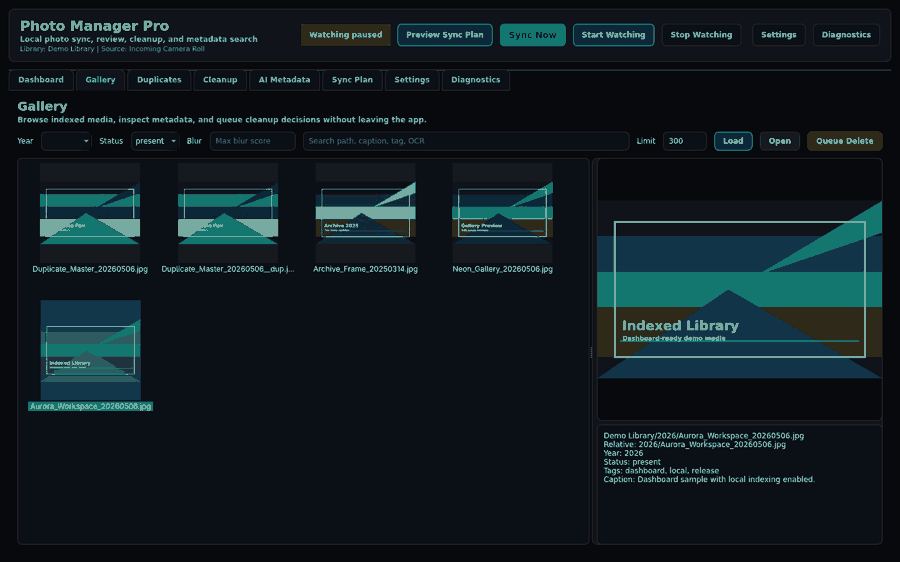
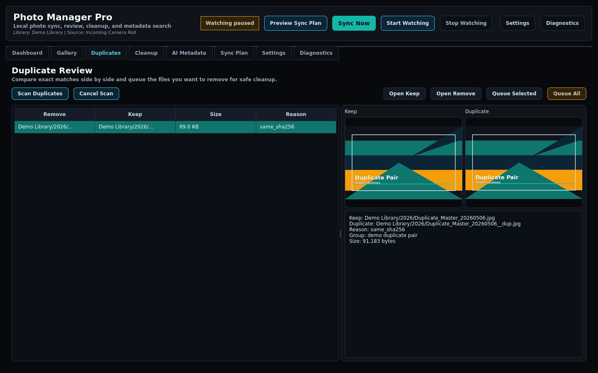

# Photo Manager Pro

[](https://github.com/Filipluke/PhotoSyncTool/actions/workflows/ci.yml)
[](https://github.com/Filipluke/PhotoSyncTool/actions/workflows/windows-exe.yml)
[](https://github.com/Filipluke/PhotoSyncTool/actions/workflows/pages.yml)
[](LICENSE)

Photo Manager Pro is a local-first desktop app for organizing, syncing, indexing, and reviewing photo and video libraries on Windows and Linux.

It gives you a PySide6 desktop GUI, one-shot sync, background folder watching, blur review, a local SQLite index, thumbnail browsing, duplicate review, and safety-focused cleanup tools. The default app works on files on your own machine and does not upload photos to a cloud service.

> Status: alpha. The main local workflows are usable, but executable distribution, installer behavior, Windows Service mode, Linux systemd mode, and GUI automation still need more clean-machine testing before this should be treated as a polished production release.

Links: [Website](https://filipluke.github.io/PhotoSyncTool/) | [Releases](https://github.com/Filipluke/PhotoSyncTool/releases) | [Issues](https://github.com/Filipluke/PhotoSyncTool/issues) | [Roadmap](ROADMAP.md)

## Screenshots







## Highlights

- Sort photos and videos from a source folder into year-based library folders.
- Detect dates from EXIF metadata, filename patterns such as `20210924_132556.jpg`, then `mtime` or `ctime` fallback.
- Copy files with verification by fast fingerprint or full SHA256.
- Optionally delete source files only after successful synchronization and verification.
- Watch a source folder in the background with `watchdog`.
- Keep a local SQLite index for files, sync events, blur scores, tags, captions, and optional OCR text.
- Browse the library through Dashboard, Gallery, Duplicate Review, Safe Delete Queue, Settings, and Diagnostics tabs.
- Review duplicate groups by content hash and queue deletion candidates instead of deleting directly.
- Move queued files to the system recycle bin with CSV export and cancel support.
- Scan blurry images with OpenCV.
- Generate local Light AI tags and captions, with optional local OCR through Tesseract.
- Run headless one-shot sync or background sync through the service entry point.
- Manage background sync as a Windows Service or Linux systemd user service.
- Build a dry-run Google Drive upload plan and upload new/changed files through the optional cloud backend.

## Requirements

- Python 3.10 or newer.
- Windows or Linux.
- PySide6 and Qt runtime support for the desktop GUI.
- On Linux, your distribution may need Qt/OpenGL/XCB runtime libraries from the system package manager.
- Tesseract is optional and is only needed for OCR.
- Inno Setup is optional and is only needed for building the Windows installer.

## Install And Run

For the current alpha, running from source is the clearest path.

### Windows

```powershell
git clone https://github.com/Filipluke/PhotoSyncTool.git
cd PhotoSyncTool
py -m venv .venv
.\.venv\Scripts\Activate.ps1
python -m pip install --upgrade pip
python -m pip install -e .
python photo_manager_gui.py
```

### Linux

```bash
git clone https://github.com/Filipluke/PhotoSyncTool.git
cd PhotoSyncTool
python3 -m venv .venv
source .venv/bin/activate
python -m pip install --upgrade pip
python -m pip install -e .
python photo_manager_gui.py
```

`photo_manager_gui.py` is the launcher. The main desktop interface lives in `photo_manager_qt.py`.

When a public PyPI release is available, installation should look like this:

```powershell
python -m pip install photosync-tool
photo-manager-pro
```

Optional OCR support for source installs:

```powershell
python -m pip install -e ".[ai]"
```

OCR also requires a local Tesseract installation.

Optional Google Drive upload support:

```powershell
python -m pip install -e ".[cloud]"
photo-manager-drive plan --root "D:\Photos" --plan-out "D:\Photos\google-drive-plan.csv"
photo-manager-drive upload --root "D:\Photos" --execute
photo-manager-drive download-plan --root "D:\Photos" --plan-out "D:\Photos\google-drive-download-plan.csv"
```

Google Drive support requires a Google Cloud OAuth desktop client JSON saved outside the repository. See [docs/GOOGLE_DRIVE_SYNC.md](docs/GOOGLE_DRIVE_SYNC.md).

The desktop app also includes a `Cloud Sync` tab for choosing the OAuth JSON, authenticating, building plans, and running Drive transfers.

## Quick Start

1. Launch the app with `python photo_manager_gui.py`.
2. Choose the source folder that contains incoming photos or videos.
3. Choose the library root where organized files should be copied.
4. Run a one-shot sync first and review the result.
5. Rebuild the library index from `Library Index -> Rebuild Index`.
6. Use Dashboard and Gallery to confirm the indexed library looks right.
7. Use Duplicate Review and Safe Delete Queue only after confirming you are working on a test or backed-up library.
8. Enable background watching only after the one-shot workflow behaves as expected.

Tip: keep a small disposable demo folder for first tests. This makes it easy to verify copy, index, duplicate, blur, and delete-queue behavior without touching important originals.

## Data Safety

Photo Manager Pro is designed around reviewable file operations:

- Normal sync, indexing, gallery, duplicate review, blur review, and Light AI run locally.
- The default app does not upload photos to a cloud service.
- Batch source deletion runs only after copy verification.
- Duplicate Review queues deletion candidates instead of deleting them directly.
- Safe Delete Queue uses the system recycle bin by default.
- Hard delete options are explicit and should only be used with disposable test libraries or confirmed backups.
- Google Drive synchronization is planned as a future optional backend, not part of the default local workflow.

Update checks read public PyPI package metadata. Optional OCR runs locally when the user installs and enables the needed OCR dependencies.

## Configuration

User settings are stored outside the repository/application folder.

Windows:

```text
%APPDATA%\PhotoManagerPro\photo_manager_config.json
%APPDATA%\PhotoManagerPro\photo_manager_service.log
```

Linux:

```text
~/.config/PhotoManagerPro/photo_manager_config.json
~/.config/PhotoManagerPro/photo_manager_service.log
```

If an old `photo_manager_config.json` exists next to the source files, the GUI can still read it as a legacy fallback. New saves go to the per-user config location.

## Library Index

The app keeps a local SQLite index named `photo_manager_index.sqlite3` inside the selected photo root. The index is local and disposable: it can be rebuilt from the library, sync logs, and blur CSVs.

The index stores:

- media file paths, sizes, timestamps, years, dimensions, status, and optional quick hashes,
- sync events from batch sync, background sync, and the headless service,
- blur scores imported from `blur_tool.py`,
- captions, tags, OCR text, and future AI embedding data.

Dashboard, Gallery, Duplicates, Delete Queue, and Light AI use this same index. After changing the root folder or importing a large existing library, rebuild the index first.

Gallery thumbnails are cached in `.photo_manager_cache/thumbnails` inside the selected root. The cache is ignored by the indexer and can be deleted safely; it will be rebuilt as needed.

## Background Sync

The GUI has two startup options:

- `Autostart background on launch` starts folder watching after the app opens.
- `Open on Windows startup` adds an entry to `HKCU\Software\Microsoft\Windows\CurrentVersion\Run`.

The headless service entry point can run one sync, run a foreground watcher, or manage platform service commands:

```powershell
photo-manager-service once
photo-manager-service run
photo-manager-service install
photo-manager-service start
photo-manager-service status
photo-manager-service stop
photo-manager-service restart
photo-manager-service uninstall
```

On Windows, service commands use Windows Services through `pywin32`. On Linux, the same commands manage a systemd user service named `photo-manager-pro.service`.

Linux systemd flow:

```bash
source .venv/bin/activate
photo-manager-pro
photo-manager-service once
photo-manager-service install
photo-manager-service start
photo-manager-service status
journalctl --user -u photo-manager-pro.service -f
```

Use `systemctl --user start|stop|restart|status photo-manager-pro.service` when managing the service directly. If the service should keep running after logout, enable lingering with `loginctl enable-linger "$USER"`.

Service mode is implemented, but still needs real-world install/start/stop/uninstall testing on clean Windows and Linux machines.

## Schedule

The GUI has a `Sync hours` field and a simple weekly schedule editor. The hour field accepts one or more ranges:

- `0-24` means all day.
- `8-18` means sync only during that time window.
- `22-7` means an overnight window crossing midnight.
- `8-12,14-18` means multiple windows in one day.

In background sync mode, files detected outside the allowed window are queued and processed when the window opens again.

## Command Line Tools

Editable/source installs expose these entry points:

```text
photo-manager-pro       Launch the desktop app
photo-manager-service   Run one-shot sync, foreground watcher, or service commands
photo-manager-index     Rebuild or update the local SQLite index
photo-manager-drive     Plan/auth/upload/download through the optional Google Drive backend
photo-blur-tool         Scan and review blurry images
photo-sorter            Legacy/simple CLI sorter
```

Useful examples:

```powershell
photo-manager-service once
photo-manager-service run --config "$env:APPDATA\PhotoManagerPro\photo_manager_config.json"
photo-manager-index rebuild --root "D:\Photos"
photo-manager-drive plan --root "D:\Photos"
photo-blur-tool scan --root "D:\Photos" --out blur-candidates.csv
```

## Development

```powershell
python -m pip install -e ".[dev]"
python -m ruff check .
python -m pytest
```

Optional local pre-commit setup:

```powershell
python -m pre_commit install
python -m pre_commit run --all-files
```

The current tests cover date parsing, copy verification, safe destination naming, media filtering, sync schedule logic, duplicate scanning, sync report export, package version consistency, and GUI smoke startup.

See [CONTRIBUTING.md](CONTRIBUTING.md) for the public-repository quality bar.

## Packaging

Windows executable build:

```powershell
python -m pip install --upgrade ".[exe]"
pyinstaller --noconfirm --onefile --windowed --name PhotoManagerPro --icon photosync_tool_assets/photo_manager_icon.ico --add-data "photosync_tool_assets;photosync_tool_assets" photo_manager_gui.py
```

The executable is written to `dist/PhotoManagerPro.exe`.

Windows installer build:

```powershell
iscc installer\PhotoManagerPro.iss
```

The installer output is written to `release/`.

Full release instructions live in [RELEASE.md](RELEASE.md). Version history lives in [CHANGELOG.md](CHANGELOG.md).

## Known Gaps

- Windows executable and installer builds still need clean-machine smoke testing.
- Windows Service and Linux systemd flows are implemented but need more real-world hardening.
- Signed Windows releases are not configured yet.
- Google Drive synchronization is alpha: no delete mirroring or automatic conflict resolution yet.
- GUI automation is intentionally light while the desktop workflow is still changing.

## Project Layout

```text
photo_manager_core.py       Core sync, date detection, copy, and file helpers
photo_manager_features.py   Gallery, delete queue, duplicate review, and AI helpers
photo_manager_index.py      SQLite library index and related commands
photo_manager_qt.py         Main PySide6 desktop interface
photo_manager_service.py    Headless runner and platform service entry point
blur_tool.py                Blur detection workflow
sort_photos_script.py       Legacy/simple CLI sorter
tests/                      Pytest coverage for core workflows
docs/                       GitHub Pages site and screenshots
installer/                  Inno Setup installer definition
```

## Roadmap

The public roadmap lives in [ROADMAP.md](ROADMAP.md).

Related docs:

- [docs/SYSTEMD.md](docs/SYSTEMD.md) for Linux background sync with systemd.
- [docs/GOOGLE_DRIVE_SYNC.md](docs/GOOGLE_DRIVE_SYNC.md) for the planned Google Drive backend.
- [docs/SCREENSHOTS.md](docs/SCREENSHOTS.md) for screenshot capture guidance.

## License

This project is licensed under the [MIT License](LICENSE).
